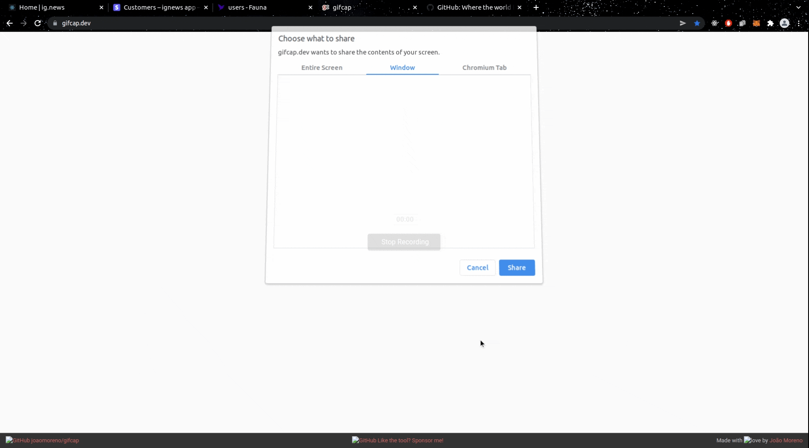

<p align="left">
   
</p>


> Read the best of news about tech
> 
[](https://github.com/ZaninDe)
[](#)
[](https://github.com/ZaninDe/ignews/stargazers)
[](https://github.com/ZaninDe/ignews/network/members)
[](https://github.com/ZaninDe/ignews/graphs/contributors)

---

# :pushpin: Table of Contents

- [:pushpin: Table of Contents](#pushpin-table-of-contents)
- [:rocket: Features](#rocket-features)
      - [Enjoy your subscription and get access entire of the posts](#enjoy-your-subscription-and-get-access-entire-of-the-posts)
- [:construction_worker: Installation](#construction_worker-installation)
  - [necessary settings](#necessary-settings)
    - [**Requirements**](#requirements)
    - [**Clone the project**](#clone-the-project)
    - [**Running the project**](#running-the-project)
- [:postbox: Faq](#postbox-faq)
- [:bug: Issues](#bug-issues)
- [:tada: Contributing](#tada-contributing)
- [:closed_book: License](#closed_book-license)

<br />
<p align="center"></p>

# :rocket: Features

* #### Login in with your github account.
* #### Subscribe and read your favorite posts


#### Enjoy your subscription and get access entire of the posts


# :construction_worker: Installation

## necessary settings

### **Requirements**

What you'll need:

- [Git](https://git-scm.com/)
- [Yarn](https://classic.yarnpkg.com)
- [Stripe CLI](https://stripe.com/docs/stripe-cli)

Create account and configure the external services:

- [Stripe](https://stripe.com/)
- [FaunaDB](https://fauna.com/)
- [Prismic CMS](https://prismic.io/)

*Services settings are located in the servicesConfig.md file in the project root*

### **Clone the project**

```bash
# Execute the command bellow to clone the repositore
$ git clone https://github.com/ZaninDe/ignews.git
# go to directory
$ cd ignews
```

### **Running the project**

```bash
# Execute yarn to install the dependencies
$ yarn
# in the root of project, create a new file and clone .env.local.example
# change the name of file copy to .env.local
# fill the enviroment variables following the guide of the comments
$ cp .env.local.example .env.local
# Execute stripe listen to listen webhooks events
$ stripe listen --forward-to localhost:3000/api/webhooks 
# to run the application:
$ yarn dev
```

---


# :postbox: Faq

**Question:** What are the tecnologies used in this project?

**Answer:** The tecnologies used in this project are [React](https://pt-br.reactjs.org/) + [Styled Components](https://styled-components.com/) to handle scoped CSS.

# :bug: Issues

Feel free to **file a new issue** with a respective title and description on the [Go Barber](https://github.com/ZaninDe/ignews/issues) repository. If you already found a solution to your problem, **I would love to review your pull request**! Have a look at our [contribution guidelines](https://github.com/ZaninDe/ignews/blob/master/CONTRIBUTING.md) to find out about the coding standards.

# :tada: Contributing

Check out the [contributing](https://github.com/ZaninDe/ignews/blob/master/CONTRIBUTING.md) page to see the best places to file issues, start discussions and begin contributing.

# :closed_book: License

Released in 2020 (Work in progress)
This project is under the [MIT license](https://github.com/ZaninDe/ignews/master/LICENSE).

Made with love by [Gabriel Zanin](https://github.com/ZaninDe) 🚀